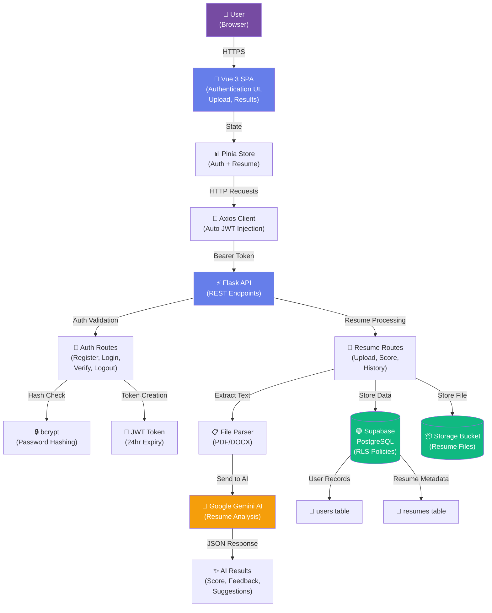
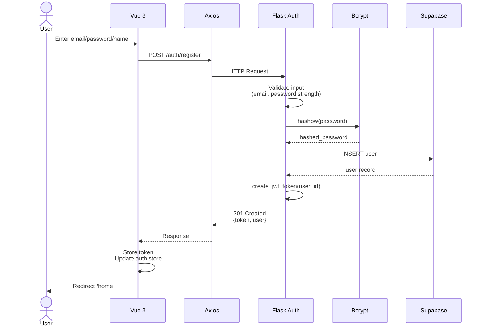
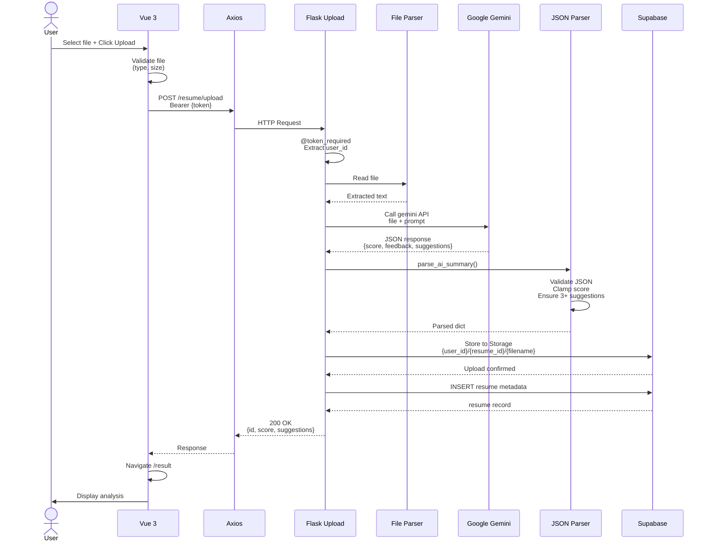
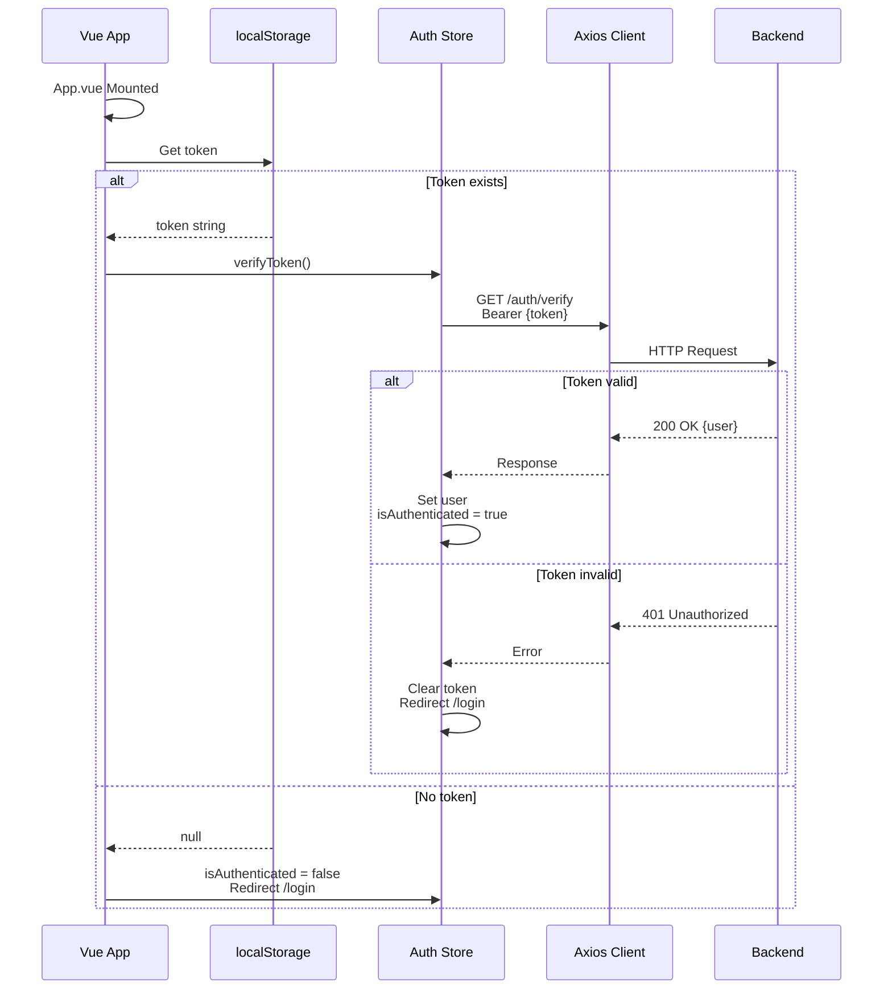

# System Architecture

## Overview

The Resume Optimizer is a **full-stack web application** for AI-powered resume analysis using modern cloud-native technologies. The architecture follows a **three-tier pattern**: Frontend (Vue 3 SPA), Backend (Flask REST API), and Data (Supabase PostgreSQL).

## System Architecture Diagram



## Component Architecture

### Frontend Layer (Vue 3 + TypeScript)

**Purpose:** Render user interface, manage client-side state, handle user interactions

```
App.vue (Root)
├── Router (Vue Router 4)
│   ├── Home.vue (Public)
│   ├── Login.vue (Public)
│   ├── Register.vue (Public)
│   ├── Upload.vue (Protected)
│   ├── Result.vue (Protected)
│   └── History.vue (Protected)
├── Stores (Pinia)
│   ├── auth.ts
│   │   ├── user: User | null
│   │   ├── token: string | null
│   │   ├── isAuthenticated: computed
│   │   ├── login(): Promise
│   │   ├── register(): Promise
│   │   └── logout(): void
│   └── resume.ts
│       ├── currentResume: Resume | null
│       ├── history: Resume[]
│       ├── uploadResume(): Promise
│       └── fetchHistory(): Promise
└── API Client (Axios)
    ├── Interceptor: Adds Authorization header
    ├── auth.ts (auth endpoints)
    └── resume.ts (resume endpoints)
```

**Key Design Decisions:**

- **Composition API:** Better code organization than Options API
- **Vue Router Guards:** Protect routes requiring authentication
- **Pinia Over Vuex:** Smaller bundle, simpler syntax, better TypeScript support
- **Axios Interceptor:** Automatic JWT injection to all requests

### Backend Layer (Flask + Python)

**Purpose:** Business logic, API endpoints, external service integration

```
Flask App (app.py)
├── Auth Blueprint (/auth)
│   ├── POST /register
│   │   ├── Validate input (email, password strength)
│   │   ├── Hash password (bcrypt)
│   │   ├── Create user in DB
│   │   └── Return JWT token (24hr expiry)
│   ├── POST /login
│   │   ├── Fetch user by email
│   │   ├── Verify password
│   │   └── Return JWT token
│   ├── POST /logout
│   └── GET /verify
│       └── Validate token
├── Resume Routes
│   ├── POST /resume/upload
│   │   ├── @token_required decorator
│   │   ├── Validate file (type, size)
│   │   ├── Store in Supabase Storage
│   │   ├── Call Google AI API
│   │   ├── Parse AI response (JSON)
│   │   ├── Store metadata in DB
│   │   └── Return analysis
│   ├── GET /resume/<id>/score
│   │   ├── Verify user ownership
│   │   └── Return cached analysis
│   └── GET /resume/history
│       ├── Query user's resumes
│       └── Return list with metadata
├── Middleware
│   ├── CORS handler
│   ├── @token_required decorator
│   └── Error handlers
└── Services
    ├── process_with_google_ai()
    │   ├── Read file (PDF/DOCX)
    │   ├── Call Gemini API
    │   └── Return JSON string
    └── parse_ai_summary()
        ├── Extract JSON from response
        ├── Validate score (0-100)
        ├── Ensure 3+ suggestions
        └── Return typed dict
```

**Key Design Decisions:**

- **Blueprint Pattern:** Organize routes by functionality (auth vs resume)
- **Decorator Pattern (@token_required):** Reusable authentication middleware
- **Separation of Concerns:** AI processing separate from API routing
- **Error Handling:** Try-catch with meaningful error messages

### Data Layer (Supabase PostgreSQL)

**Purpose:** Persistent storage, user data isolation via RLS policies

```
PostgreSQL Database
├── users table
│   ├── id (BIGSERIAL PK)
│   ├── email (UNIQUE)
│   ├── name
│   ├── password_hash
│   ├── created_at
│   └── RLS Policy: User can only read own row
├── resumes table
│   ├── id (UUID PK)
│   ├── user_id (FK → users.id)
│   ├── filename
│   ├── file_path (cloud storage path)
│   ├── score (0-100)
│   ├── feedback (text)
│   ├── suggestions (JSONB array)
│   ├── created_at
│   ├── Index: (user_id) for fast queries
│   ├── Index: (created_at DESC) for history
│   └── RLS Policies:
│       ├── User can SELECT own resumes
│       └── User can INSERT own resumes
└── Supabase Storage (/resumes bucket)
    └── Path structure: {user_id}/{resume_id}/{filename}
```

**Key Design Decisions:**

- **Row-Level Security (RLS):** Database enforces user data isolation
- **JSONB for Suggestions:** Flexible array storage without extra table
- **Indexes:** (user_id, created_at DESC) optimizes history queries
- **Cascade Delete:** Deleting user automatically deletes resumes
- **Cloud Storage:** Resume files not stored in DB (better for large files)

## Data Flow Diagrams

### 1. Registration Flow



### 2. Resume Upload & Analysis Flow



### 3. Authentication Flow on App Load



## Security Architecture

### Authentication & Authorization

```
┌─ Frontend (localStorage) ┐
│  JWT Token (24hr expiry)  │
└────────────┬──────────────┘
             │ Included in every request
             │ Header: Authorization: Bearer {token}
             ▼
┌─────────────────────────────────┐
│  Flask @token_required Decorator │
│  ├─ Extracts token from header  │
│  ├─ Validates signature (HS256) │
│  ├─ Checks expiration time      │
│  └─ Decodes user_id & email     │
└────────────┬────────────────────┘
             │ If valid, proceeds
             ▼
┌─────────────────────────────────┐
│  Endpoint Handler                │
│  ├─ Uses request.user_id         │
│  ├─ Queries DB for user's data   │
│  └─ RLS policy enforces access   │
└─────────────────────────────────┘
```

### Password Security

```
User Password Input
        │
        ▼ (bcrypt.hashpw with salt)
Hashed Password: $2b$12$...
        │
        ├─ Stored in DB
        │
        └─ Login: bcrypt.checkpw(input, hash)
           ├─ Match ✓ → Generate JWT
           └─ No match ✗ → 401 Unauthorized
```

### Database Row-Level Security (RLS)

```
User A attempts to query User B's resume:

SELECT * FROM resumes WHERE id = 'uuid-b'
        │
        ▼ (RLS Policy Check)
Policy: "Users can read own resumes"
  IF user_id = auth.uid() THEN allow
  ELSE deny
        │
        ▼
User A's user_id ≠ User B's user_id
        │
        ▼
404: Resume not found (policy blocked access)
```

## Scalability Considerations

### Current Design (MVP)

- **Single Supabase project** (adequate for MVP)
- **Synchronous API calls** (simple, works for low traffic)
- **Local file uploads** → **Cloud storage** (Supabase)
- **No caching layer** (acceptable for small user base)

### Future Scaling Strategies

#### Horizontal Scaling

```
Load Balancer
├─ Backend Instance 1 (Flask)
├─ Backend Instance 2 (Flask)
└─ Backend Instance N (Flask)
   └─ All connected to same Supabase DB
   └─ All can access same S3/GCS storage
```

#### Caching Layer

```
Frontend (Vue)
    │
    ├─ Browser cache (static assets)
    │
Backend (Flask)
    ├─ Redis cache for:
    │  ├─ User session data
    │  ├─ Recent analysis results
    │  └─ User's resume history
    │
Database (Supabase/PostgreSQL)
```

#### Asynchronous Job Processing

```
Upload Resume
    │
    ├─ Quick response: Resume ID + "Analyzing..."
    │
    └─ Queue job:
       └─ Background worker (Celery/Bull)
          ├─ Call Google AI
          ├─ Parse results
          ├─ Store in DB
          └─ Emit WebSocket event to frontend
             (Real-time: "Analysis complete!")
```

## Performance Optimizations Implemented

| Component        | Optimization                     | Benefit                          |
| ---------------- | -------------------------------- | -------------------------------- |
| Frontend Build   | Vite (ES modules)                | 10x faster build time            |
| Frontend Bundle  | Tree-shaking, code splitting     | ~50KB gzipped                    |
| Database Queries | Indexes on (user_id, created_at) | Millisecond history queries      |
| API Responses    | JSON (not XML)                   | Smaller payload size             |
| TLS              | HTTPS in production              | Secure data transmission         |
| CORS             | Origin validation                | Prevents unauthorized API access |

## Architecture Decision Records (ADRs)

### ADR-001: Supabase PostgreSQL vs Firebase

- **Decision:** Supabase (PostgreSQL wrapper)
- **Rationale:** RLS policies for multi-tenancy, SQL familiarity, lower cost
- **Trade-off:** Requires database design knowledge

### ADR-002: JWT Tokens vs Session Cookies

- **Decision:** JWT in localStorage
- **Rationale:** Stateless (scalable), SPA-friendly, cross-domain support
- **Trade-off:** Larger per-request payload, localStorage XSS vulnerability mitigation needed

### ADR-003: Google Gemini vs OpenAI

- **Decision:** Google Generative AI (Gemini 2.5 Flash)
- **Rationale:** Free tier, better PDF parsing, faster response, lower cost
- **Trade-off:** Fewer advanced customization options than OpenAI

### ADR-004: Vue 3 Composition API vs Options API

- **Decision:** Composition API
- **Rationale:** Better code organization, better TypeScript support, tree-shaking friendly
- **Trade-off:** Steeper learning curve for beginners

## Deployment Architecture

### Development

```
Localhost:3000 (Vue Dev Server with Vite)
       ↓ (proxy)
Localhost:8000 (Flask dev server)
       ↓
Supabase (cloud DB)
Google AI API
```

### Production

```
Frontend: Deployed to Vercel/Netlify
    ├─ Automatic SSL/TLS
    ├─ CDN for static assets
    └─ Automatic deployments on git push

Backend: Deployed to Render/Railway/Heroku
    ├─ Gunicorn WSGI server
    ├─ Environment variables injected
    └─ Health check endpoint

Database: Supabase (managed PostgreSQL)
    ├─ Automatic backups
    ├─ Read replicas (if needed)
    └─ Monitoring & alerting

File Storage: Supabase Storage (/resumes bucket)
    ├─ Signed URLs for secure downloads
    └─ Automatic cleanup policies
```

---
