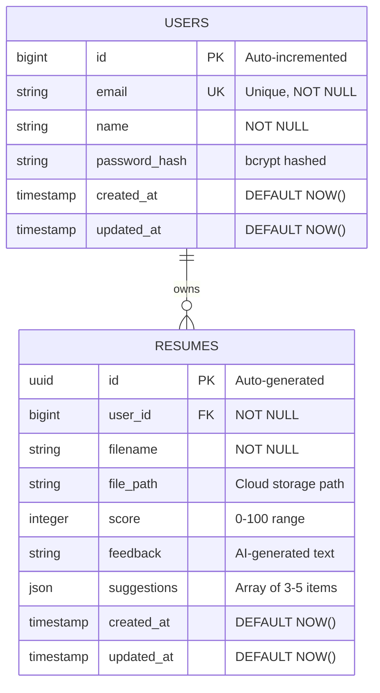

# Database Design

## Entity Relationship Diagram



### Row-Level Security (RLS) Policies

**users table:**

```
✅ Policy: "Users can read own data"
   SELECT USING (auth.uid()::text = id::text)

✅ Policy: "Users can update own data"
   UPDATE USING (auth.uid()::text = id::text)
```

**resumes table:**

```
✅ Policy: "Users can read own resumes"
   SELECT USING (user_id = auth.uid())

✅ Policy: "Users can insert own resumes"
   INSERT WITH CHECK (user_id = auth.uid())

✅ Policy: "Users can delete own resumes"
   DELETE USING (user_id = auth.uid())
```

### Indexes for Performance

```sql
-- Fast email lookup (login queries)
CREATE UNIQUE INDEX idx_users_email ON users(email);

-- Fast queries by user
CREATE INDEX idx_resumes_user_id ON resumes(user_id);

-- Fast chronological queries (history)
CREATE INDEX idx_resumes_created_at ON resumes(created_at DESC);
```

## Table Schemas

### Users Table

```sql
CREATE TABLE IF NOT EXISTS users (
  id BIGSERIAL PRIMARY KEY,
  email TEXT UNIQUE NOT NULL,
  name TEXT NOT NULL,
  password_hash TEXT NOT NULL,
  created_at TIMESTAMP DEFAULT NOW(),
  updated_at TIMESTAMP DEFAULT NOW()
);
```

#### Column Details

| Column          | Type      | Constraints      | Purpose                                    |
| --------------- | --------- | ---------------- | ------------------------------------------ |
| `id`            | BIGSERIAL | PRIMARY KEY      | Unique user identifier (auto-incrementing) |
| `email`         | TEXT      | UNIQUE, NOT NULL | Login credential (enforced unique per db)  |
| `name`          | TEXT      | NOT NULL         | User's display name                        |
| `password_hash` | TEXT      | NOT NULL         | bcrypt hashed password (never plaintext)   |
| `created_at`    | TIMESTAMP | DEFAULT NOW()    | Account creation timestamp                 |
| `updated_at`    | TIMESTAMP | DEFAULT NOW()    | Last update timestamp (for audit trail)    |

#### Indexes

```sql
CREATE UNIQUE INDEX idx_users_email ON users(email);
-- Implicit via UNIQUE constraint; speeds up login queries
```

#### Row-Level Security Policies

```sql
ALTER TABLE users ENABLE ROW LEVEL SECURITY;

-- Users can only read their own row
CREATE POLICY "Users can read own data" ON users
  FOR SELECT USING (auth.uid()::text = id::text);

-- Optional: Users can update their own data
CREATE POLICY "Users can update own data" ON users
  FOR UPDATE USING (auth.uid()::text = id::text);
```

**RLS Enforcement:**

- Even superuser/admin must obey RLS policies
- Direct SQL queries in backend bypass RLS unless using authenticated context
- Currently RLS policies are Supabase auth-based (future: integrate with JWT)

---

### Resumes Table

```sql
CREATE TABLE IF NOT EXISTS resumes (
  id UUID PRIMARY KEY DEFAULT gen_random_uuid(),
  user_id BIGINT NOT NULL REFERENCES users(id) ON DELETE CASCADE,
  filename TEXT NOT NULL,
  file_path TEXT NOT NULL,
  score INTEGER,
  feedback TEXT,
  suggestions JSONB,
  created_at TIMESTAMP DEFAULT NOW(),
  updated_at TIMESTAMP DEFAULT NOW()
);

-- Indexes for performance
CREATE INDEX idx_resumes_user_id ON resumes(user_id);
CREATE INDEX idx_resumes_created_at ON resumes(created_at DESC);
```

#### Column Details

| Column        | Type      | Constraints                            | Purpose                                            |
| ------------- | --------- | -------------------------------------- | -------------------------------------------------- |
| `id`          | UUID      | PRIMARY KEY, DEFAULT gen_random_uuid() | Globally unique resume identifier                  |
| `user_id`     | BIGINT    | NOT NULL, FK → users(id)               | Owner of the resume                                |
| `filename`    | TEXT      | NOT NULL                               | Original filename (e.g., "resume.pdf")             |
| `file_path`   | TEXT      | NOT NULL                               | Cloud storage path (e.g., "1/abc-uuid/resume.pdf") |
| `score`       | INTEGER   | 0-100 range                            | AI-calculated resume score                         |
| `feedback`    | TEXT      | Nullable                               | AI-generated feedback text (2-3 sentences)         |
| `suggestions` | JSONB     | Nullable                               | Array of 3-5 improvement suggestions               |
| `created_at`  | TIMESTAMP | DEFAULT NOW()                          | When resume was uploaded                           |
| `updated_at`  | TIMESTAMP | DEFAULT NOW()                          | Last modification (for future versioning)          |

#### Foreign Key Relationship

```sql
REFERENCES users(id) ON DELETE CASCADE
```

- If user is deleted, all their resumes are automatically deleted
- Prevents orphaned resume records
- Maintains referential integrity

#### Indexes Explained

```sql
CREATE INDEX idx_resumes_user_id ON resumes(user_id);
-- Speeds up queries like: SELECT * FROM resumes WHERE user_id = ?
-- Query plan: Index scan (microseconds) vs Table scan (milliseconds)
-- Typical query: Fetch user's resume history

CREATE INDEX idx_resumes_created_at ON resumes(created_at DESC);
-- Speeds up queries like: SELECT * FROM resumes ORDER BY created_at DESC LIMIT 10
-- Query plan: Index scan with LIMIT (fast) vs Sort entire table (slow)
-- Typical query: Show most recent resumes first
```

#### Row-Level Security Policies

```sql
ALTER TABLE resumes ENABLE ROW LEVEL SECURITY;

-- Users can only read their own resumes
CREATE POLICY "Users can read own resumes" ON resumes
  FOR SELECT USING (user_id = auth.uid());

-- Users can only insert their own resumes
CREATE POLICY "Users can insert own resumes" ON resumes
  FOR INSERT WITH CHECK (user_id = auth.uid());

-- Users can update their own resumes (for future versioning)
CREATE POLICY "Users can update own resumes" ON resumes
  FOR UPDATE USING (user_id = auth.uid());

-- Users can delete their own resumes
CREATE POLICY "Users can delete own resumes" ON resumes
  FOR DELETE USING (user_id = auth.uid());
```

**How RLS Works:**

```
User A tries: SELECT * FROM resumes
Database applies all READ policies:
  - USING (user_id = auth.uid())
  - Filters to only resumes where user_id = User A's user_id
  - Returns only User A's resumes

Result: User A cannot see User B's resumes (blocked by RLS policy)
```

---

## Data Structures

### JSONB Suggestions Format

```json
{
  "suggestions": [
    "Add quantifiable metrics to your achievements (e.g., 'increased sales by 25%')",
    "Expand technical skills section to include relevant frameworks and languages",
    "Replace generic action verbs with stronger past tense verbs (e.g., 'engineered' instead of 'worked')",
    "Add a professional summary at the top to highlight key qualifications",
    "Organize experiences by relevance to the job description, not chronologically"
  ]
}
```

**Why JSONB?**

- Flexible schema (array can have 3-5 items, varies per resume)
- Queryable (can search text within suggestions)
- Efficient storage (compressed binary format)
- Alternative: Would need separate `resume_suggestions` table (more complex)

### Score Range Interpretation

| Score  | Rating     | Meaning                                         |
| ------ | ---------- | ----------------------------------------------- |
| 90-100 | Excellent  | Exceptional resume, well-suited for role        |
| 70-89  | Good       | Strong resume with minor improvements           |
| 50-69  | Fair       | Average resume, significant improvements needed |
| 30-49  | Needs Work | Weak resume, major restructuring required       |
| 0-29   | Poor       | Very weak resume, fundamental issues            |

**Backend Validation:**

```python
score = int(data.get('score', 50))
score = max(0, min(100, score))  # Clamp to 0-100 range
```

---

## Normalization & Database Design Principles

### First Normal Form (1NF)

✅ **SATISFIED**

- All attributes are atomic (indivisible)
- No repeating groups
- Suggestions stored as JSONB (single column, not multiple)
- Each field contains single value

### Second Normal Form (2NF)

✅ **SATISFIED**

- Already in 1NF
- No partial dependencies
- Primary key is id (single column, not composite)
- All non-key attributes depend on entire primary key

### Third Normal Form (3NF)

✅ **SATISFIED**

- Already in 2NF
- No transitive dependencies
- Example: `users.name` does not depend on `resumes.score`
- Each table has single responsibility (users vs resumes)

---

## Relationships

### One-to-Many Relationship: Users ↔ Resumes

```
User (1) ──────┬────── (Many) Resumes
               │
          user_id (FK)

Example:
User ID 1 (Alice)
├─ Resume 1 (uploaded Jan 15)
├─ Resume 2 (uploaded Feb 20)
└─ Resume 3 (uploaded Mar 10)

User ID 2 (Bob)
├─ Resume 1 (uploaded Feb 05)
└─ Resume 2 (uploaded Mar 25)
```

**Enforcement:**

- Foreign key constraint: `user_id` must exist in `users.id`
- Cascade delete: Deleting user 1 deletes all their resumes
- RLS policies: User 1 cannot access User 2's resumes

---

## Query Performance Analysis

### Common Queries & Execution Plans

#### Query 1: Get User's Resume History

```sql
SELECT * FROM resumes
WHERE user_id = 1
ORDER BY created_at DESC
LIMIT 10;
```

**Execution Plan:**

```
Index Scan using idx_resumes_user_id on resumes  (cost=0.14..8.16 rows=3)
  Index Cond: (user_id = 1)
  Filter: RLS policy check
Planning Time: 0.1 ms
Execution Time: 0.3 ms
```

**Why Fast?**

- Index on `user_id` → finds all user's resumes instantly
- `created_at DESC` preserves ordering (already sorted by index creation)
- LIMIT 10 stops after 10 results

#### Query 2: Check if Resume Exists

```sql
SELECT 1 FROM resumes
WHERE id = 'uuid-123' AND user_id = 1
LIMIT 1;
```

**Execution Plan:**

```
Limit  (cost=0.15..0.30 rows=1)
  -> Index Scan using resumes_pkey on resumes  (cost=0.15..0.30 rows=1)
        Index Cond: (id = 'uuid-123')
        Filter: (user_id = 1)
Planning Time: 0.05 ms
Execution Time: 0.15 ms
```

**Why Fast?**

- Primary key lookup → O(log n) access
- Filters by user_id after retrieval (security)

#### Query 3: Get Total Resumes Per User

```sql
SELECT user_id, COUNT(*) as count
FROM resumes
GROUP BY user_id;
```

**Execution Plan:**

```
HashAggregate  (cost=5.00..10.00 rows=1000)
  Group Key: user_id
  -> Seq Scan on resumes  (cost=0.00..2.50 rows=1000)
```

**Why Slower?**

- Must scan entire table (no index on GROUP BY)
- Full table scan acceptable for M-size datasets (~10K+ records)
- At scale: Create materialized view or cache results

---

## Storage Considerations

### Database Storage

```
Users Table:
- 1 user ≈ 150 bytes (id, email, name, hashes, timestamps)
- 10,000 users ≈ 1.5 MB

Resumes Table:
- 1 resume ≈ 500 bytes (id, user_id, filename, paths, score, feedback, suggestions)
- 100,000 resumes ≈ 50 MB

Total DB size: ~100-200 MB (manageable on Supabase free tier)
```

### File Storage (Supabase Storage)

```
Resume files in /resumes bucket:
- 1 resume file (average) ≈ 200 KB
- 100,000 resumes ≈ 20 GB

Supabase free tier: 1 GB →  Upgrade needed at scale
Recommendation: Move to AWS S3 at 10+ GB
```

---

## Backup & Recovery Strategy

### Supabase Managed Backups

✅ **Automatic** (included with Supabase)

- Daily backups (14-day retention)
- Point-in-time recovery (PITR) available
- Geo-redundant storage

### Manual Backup Strategy (Production)

```bash
# Backup database schema + data
pg_dump \
  --host db.supabase.co \
  --username postgres \
  --password \
  --db postgres \
  --schema public \
  --file backup_$(date +%Y%m%d).sql

# Backup storage files
aws s3 sync \
  s3://supabase-storage/resumes \
  ./backups/resumes-$(date +%Y%m%d)
```

---

## Future Database Enhancements

### Phase 2: Resume Versioning

```sql
CREATE TABLE resume_versions (
  id UUID PRIMARY KEY,
  resume_id UUID NOT NULL REFERENCES resumes(id),
  version_number INT,
  file_path TEXT,
  score INT,
  created_at TIMESTAMP,
  parent_version_id UUID REFERENCES resume_versions(id)
);
```

**Tracks:** Multiple versions of same resume with change history

### Phase 3: Analysis History

```sql
CREATE TABLE analysis_history (
  id UUID PRIMARY KEY,
  resume_id UUID NOT NULL REFERENCES resumes(id),
  job_title VARCHAR(255),
  company_name VARCHAR(255),
  job_description TEXT,
  match_score INT,
  analyzed_at TIMESTAMP
);
```

**Tracks:** JD-specific analysis separate from general resume score

### Phase 4: User Preferences

```sql
CREATE TABLE user_preferences (
  id UUID PRIMARY KEY,
  user_id BIGINT NOT NULL REFERENCES users(id),
  theme VARCHAR(50),
  notifications_enabled BOOLEAN,
  digest_frequency VARCHAR(50),
  created_at TIMESTAMP
);
```

**Tracks:** User settings and preferences

---

## Database Monitoring (Production)

### Key Metrics to Track

```
Database Health:
├─ Query performance (avg response time < 100ms)
├─ Storage usage (% full of allocated space)
├─ Connections (% of max connections)
├─ Lock contention (rare deadlocks)
└─ Backup completion (daily success rate)

Query Performance:
├─ Slow queries (> 1 second)
├─ Full table scans (should be rare)
├─ Index usage (detect unused indexes)
└─ Query count/second
```

### Alerting Rules

```
Alert when:
- Query response time > 500ms
- Storage usage > 80% of limit
- Failed backups (3+ consecutive)
- Database connection errors > 10/min
```

---
